# LDChartControlPlus

DLL em .NET criada em 2006 e com última atualização em 2008 para gerar gráficos em aplicações Windowsforms com .NET Framework 3.5.

Construir as próprias ferramentas é o que molda a base de um desenvolvedor. 🛠️📊

Acabei de disponibilizar no meu GitHub o código-fonte do LDChartControlPlus.dll, um projeto que comecei em 2006 e mantive até 2008. 

Trata-se de uma suíte completa de controles de gráficos em C# que desenvolvi do zero usando a API GDI+ da Microsoft, rodando em .NET 3.5.

Naquela época, componentes avançados de relatórios e gráficos eram escassos e pagos. O MS Chart Control oficial só chegaria mais tarde. Em vez de adquirir licenças de terceiros, decidi encarar o desafio de entender como a renderização vetorial e a matemática de tela funcionavam por baixo dos panos para criar minha própria solução.

Foram centenas de linhas de código 100% autorais — sem bibliotecas de terceiros, sem Stack Overflow nos moldes de hoje e muito menos Inteligência Artificial para gerar snippets.

Essa experiência de desenhar pixels, sombras, eixos e legendas na raça me deu uma bagagem sólida de arquitetura e manipulação de memória que levo até hoje na minha carreira (desde os tempos de VB6 em 2002 e migração para .NET em 2003).

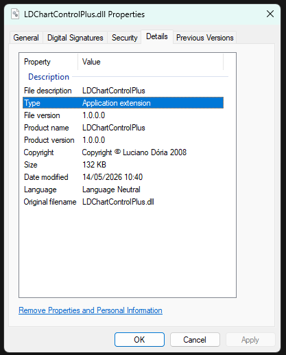

## Images

### Arquivos do projeto
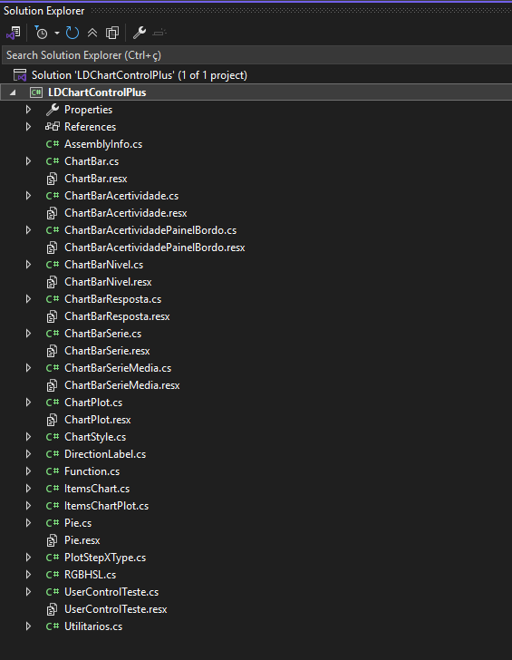
### Controles no Toolbox
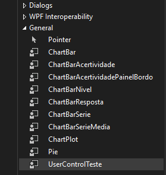
### Gráficos
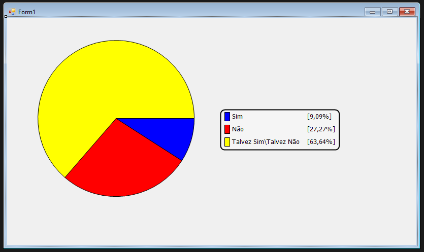

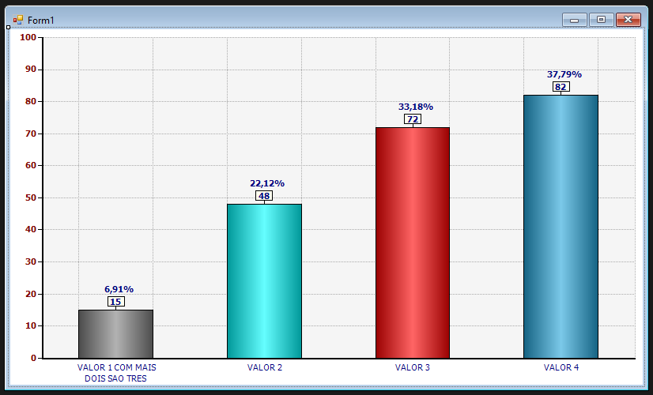
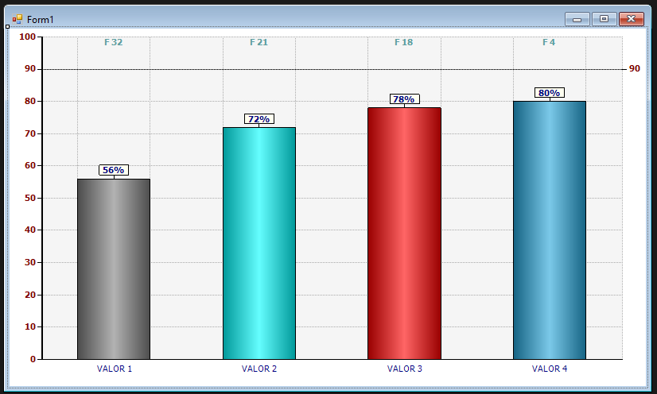
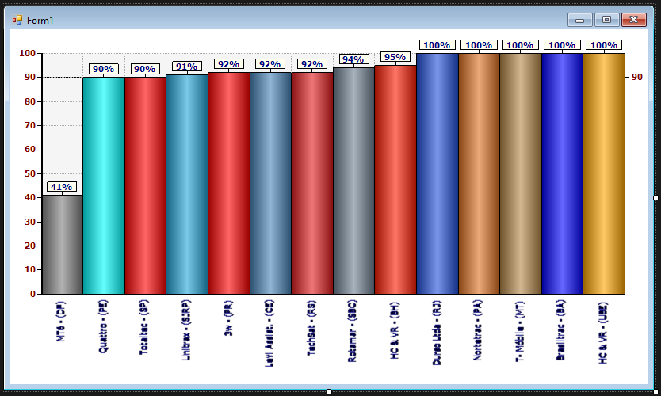
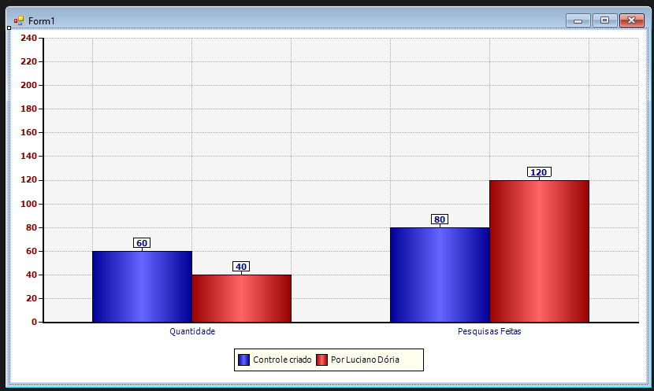
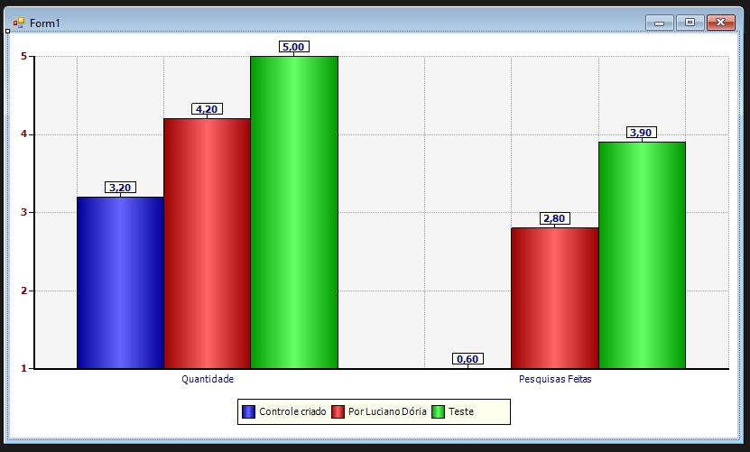
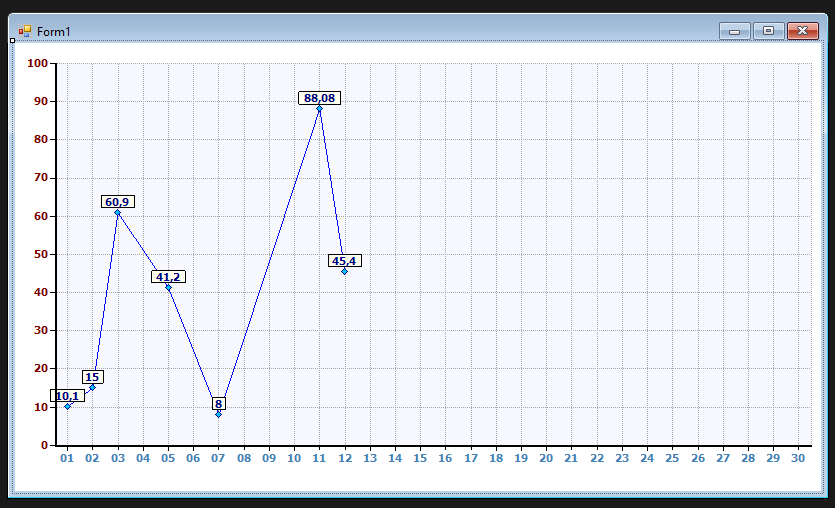

### Tela de propriedades do Componente
#### Todos os componentes tem suas próprias configurações
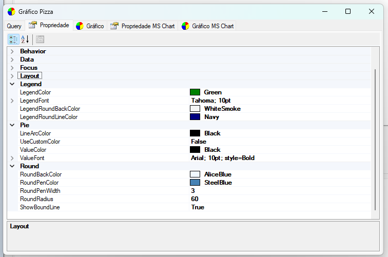
